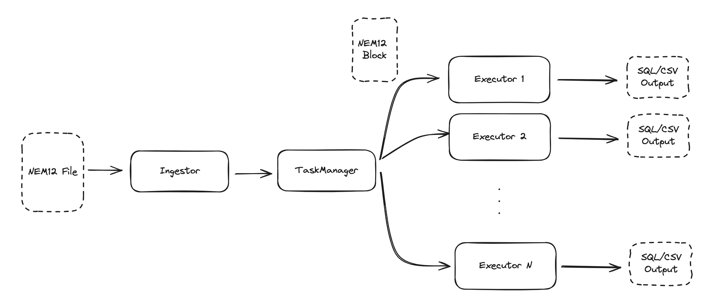

## Architecture

* 1 ingestor process that will read lines from NEM12 file, consolidate the 200 Block and pass it an executor.
* N executor processes that will process the 200 block, sum up the consumption and output them into either a CSV or SQL file.
